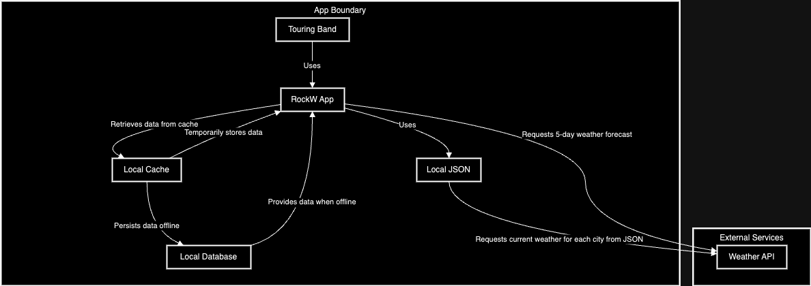

# RockW: Offline-First Approach

Welcome to RockW – where seamless offline functionality meets cutting-edge performance. Our project embraces an offline-first design, ensuring that your experience is uninterrupted, resilient, and fast, regardless of your internet connection.

## Key Features:

- **Persistent Performance:** Enjoy a fully functional application even when you're offline.
- **Data Syncing:** Automatic data synchronization once you're back online.
- **User-Centric Design:** Built with the user's needs in mind for offline access and data integrity.
- **Resource Efficiency:** Optimized to reduce data usage and conserve battery life.

## C4 Model 

*C4 Level 2: Container Diagram of RockW App showcasing the high-level architecture. It includes the Mobile App for user interaction, the Caching Service for data retrieval efficiency, and the Local Database for offline data persistence. These components interact with the External Weather API to provide real-time weather updates and forecasts for touring bands.*


## Why Offline-First?

In a world where connectivity can be inconsistent, an offline-first approach ensures that your application remains reliable. We prioritize local data processing and storage, so users can access core features without a hitch. When a connection is available, the app syncs and updates seamlessly.

## Get Started:

To get started with RockW, clone the repository and follow the setup instructions. Your journey towards a more reliable, user-friendly offline experience begins here!

```bash
git clone https://github.com/andermelo/rock_w.git
cd rock_w
```

To run the project:

```bash
flutter run
```

To run the tests:

```bash
flutter test
```

### Using Melos [Optional]

This project utilizes [Melos](https://melos.invertase.dev/getting-started) to facilitate command management. If you wish to use Melos, follow the steps below:

```bash
dart pub global activate melos
melos bootstrap
```

To run tests using Melos:

```bash
melos test
```

Other available Melos commands in the project's melos.yaml:

- `analyze`: Runs `flutter analyze` on all Flutter packages.
- `analyze:all`: Performs analysis on all packages without selection.
- `generate:all`: Runs file generation on all packages.
- `generate`: Runs file generation on Flutter packages only.
- `test:all`: Runs all tests and generates HTML coverage reports.
- `test`: Runs tests on all Flutter packages.
- `coverage`: Generates HTML coverage reports from existing lcov data.
- `coverage:view`: Opens the HTML coverage report in the default browser.
- `lint`: Runs the Dart analyzer on all packages.
- `format`: Formats all Dart files in the repository.

If you want to generate and view the HTML report without Melos, run this in the terminal:

```bash
flutter test --coverage
genhtml coverage/lcov.info -o coverage/html
open coverage/html/index.html
```


