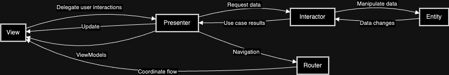
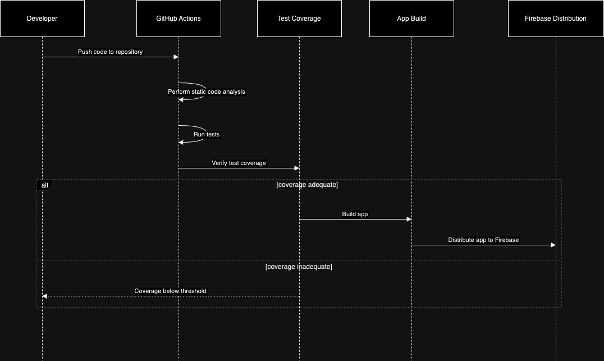

# RockW: Offline-First Approach

Welcome to RockW – where seamless offline functionality meets cutting-edge performance. Our project embraces an offline-first design, ensuring that your experience is uninterrupted, resilient, and fast, regardless of your internet connection.

[](https://www.figma.com/community/file/1304471029185774897/rockw-app)


## Key Features:

- **Persistent Performance:** Enjoy a fully functional application even when you're offline.
- **Data Syncing:** Automatic data synchronization once you're back online.
- **User-Centric Design:** Built with the user's needs in mind for offline access and data integrity.
- **Resource Efficiency:** Optimized to reduce data usage and conserve battery life.

## Architecture

### Design pattern


### C4 Level 2


*C4 Level 2: Container Diagram of RockW App showcasing the high-level architecture. It includes the Mobile App for user interaction, the Caching Service for data retrieval efficiency, and the Local Database for offline data persistence. These components interact with the External Weather API to provide real-time weather updates and forecasts for touring bands.*


## Why Offline-First?

In a world where connectivity can be inconsistent, an offline-first approach ensures that your application remains reliable. We prioritize local data processing and storage, so users can access core features without a hitch. When a connection is available, the app syncs and updates seamlessly.

## Get Started:

To get started with RockW, clone the repository and follow the setup instructions. Your journey towards a more reliable, user-friendly offline experience begins here!

>Flutter Version: 3.13.9

```bash
git clone https://github.com/andermelo/rock_w.git
cd rock_w
```

To run the project:

```dart
Flutter pub get
```

>HOM
```bash
flutter run --flavor dev
```

>PROD
```bash
flutter run --flavor prd --dart-define=API_TOKEN_HERE="" --dart-define=API_PATH_HERE="" --dart-define=DD_CLIENT_TOKEN="" --dart-define=DD_ENV="" --dart-define=DD_APP_ID=""
```

To run the tests:

```bash
flutter test
```

## Continuous Integration (CI) with GitHub Actions

This project utilizes GitHub Actions to implement a Continuous Integration (CI) workflow, ensuring quality and efficiency in the software development process. Each push to the repository automatically triggers a series of operations defined in the CI workflow, as outlined below:

### CI Workflow:

1. **Code Analysis**: Upon code push to the repository, GitHub Actions performs static analysis to identify potential issues and improvements.

2. **Test Execution**: Tests are run to ensure the stability of existing functionalities.

3. **Code Coverage Verification**: The workflow checks if the test coverage meets a minimum threshold (e.g., 50%).

4. **App Build**: If the test coverage is adequate and the tests pass, the app is built.

5. **Distribution**: After a successful build, the app is automatically distributed to Firebase App Distribution, making it available to selected testers or end-users.

### Where the App is Available:

After a successful build and quality checks, the app is made available on Firebase App Distribution, where selected testers can access it for testing and validation purposes before the production release.

The following diagram illustrates the CI process using GitHub Actions:



This CI workflow ensures that our code is always in a release-ready state, maintaining the quality and reliability of the application.


## Observability and Errors with Datadog

Observability is a crucial aspect in the development and maintenance of modern applications. Martin Fowler, an authority in software engineering, emphasizes the importance of observable systems, where you can understand what's happening inside your software through logs, metrics, and traces. Observability becomes critical for diagnosing issues and optimizing application performance.


### Integrating Datadog in Flutter

In our Flutter application, we have integrated Datadog, a powerful monitoring and analytics platform that enables us to observe and understand the state of our app. Datadog offers robust logging, application performance monitoring (APM), and metric monitoring capabilities, which are essential for maintaining the health and efficiency of the application.

Here is a brief example of how we use `AppLogger`, a custom class designed to facilitate the use of Datadog in our Flutter application.

### Example of Using AppLogger

```dart
// Example of logging information
AppLogger.instance.logInfo('Application successfully started');

try {
  // Code that might throw an exception
} catch (e, stackTrace) {
  // Logging error using AppLogger
  AppLogger.instance.logError('Error while executing operation', exception: e, stackTrace: stackTrace);
}
```

### Benefits of Observability with Datadog

- Rapid Problem Detection: With detailed logs, we can quickly identify where and why an error occurred.

- Performance Analysis and Optimization: Metrics and traces allow us to analyze the app’s performance and identify areas for improvement.

- Continuous Improvement: Through constant observation, we can continually refine our application, enhancing the user experience.


### Using Melos [Optional]

This project utilizes [Melos](https://melos.invertase.dev/getting-started) to facilitate command management. If you wish to use Melos, follow the steps below:

```bash
dart pub global activate melos
melos bootstrap
```

To run tests using Melos:

```bash
melos test
```

Other available Melos commands in the project's melos.yaml:

- `analyze`: Runs `flutter analyze` on all Flutter packages.
- `analyze:all`: Performs analysis on all packages without selection.
- `generate:all`: Runs file generation on all packages.
- `generate`: Runs file generation on Flutter packages only.
- `test:all`: Runs all tests and generates HTML coverage reports.
- `test`: Runs tests on all Flutter packages.
- `coverage`: Generates HTML coverage reports from existing lcov data.
- `coverage:view`: Opens the HTML coverage report in the default browser.
- `lint`: Runs the Dart analyzer on all packages.
- `format`: Formats all Dart files in the repository.

If you want to generate and view the HTML report without Melos, run this in the terminal:

```bash
flutter test --coverage
genhtml coverage/lcov.info -o coverage/html
open coverage/html/index.html
```


